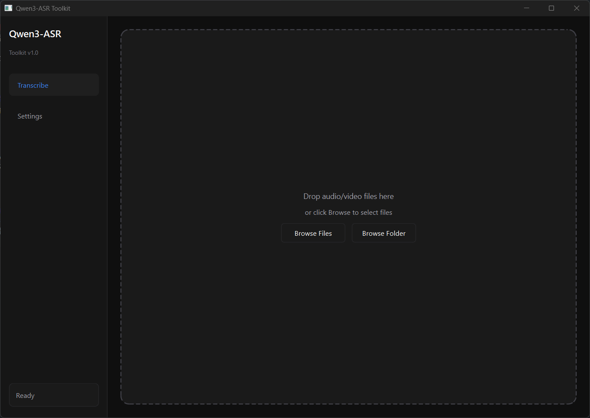

# Qwen3-ASR Desktop

[](https://www.python.org/downloads/)
[](https://www.riverbankcomputing.com/software/pyqt/)
[](https://opensource.org/licenses/MIT)
[](https://github.com/QwenLM/Qwen3-ASR-Toolkit)

A modern **desktop GUI application** for Qwen-ASR with **batch transcription** support. Built on top of the excellent [Qwen3-ASR-Toolkit](https://github.com/QwenLM/Qwen3-ASR-Toolkit), this project adds a user-friendly graphical interface for non-technical users and power users who need to process multiple files efficiently.

<p align="center">
  
</p>

---

## What's New in Desktop Edition

| Feature | CLI (Original) | Desktop (This Project) |
|---------|----------------|------------------------|
| User Interface | Command Line | Modern PyQt6 GUI |
| Batch Processing | One file at a time | Multiple files with queue |
| Drag & Drop | Not supported | Full support |
| Progress Tracking | Text output | Visual progress bars |
| Result Preview | Save to file only | In-app preview + export |
| Settings | CLI arguments | Persistent GUI settings |

---

## Key Features

### Desktop GUI
- **Modern Dark Theme** - Easy on the eyes during long transcription sessions
- **Drag & Drop** - Simply drop files or folders onto the window
- **Real-time Progress** - Visual feedback for each file and overall batch
- **In-app Preview** - View transcription results without opening external files

### Batch Processing
- **Multi-file Queue** - Add unlimited files to the processing queue
- **Folder Import** - Scan entire folders for media files
- **Status Tracking** - See pending, processing, done, and error states
- **Bulk Export** - Export all results to a folder with one click

### Core ASR (Inherited from Qwen3-ASR-Toolkit)
- **Break the 3-Minute Limit** - Process hours-long audio/video files
- **VAD-based Splitting** - Smart chunking at natural pauses
- **Parallel Processing** - Multi-threaded API calls for speed
- **SRT Generation** - Create subtitle files automatically
- **11 Languages** - Arabic, Chinese, English, French, German, Italian, Japanese, Korean, Portuguese, Russian, Spanish

---

## Installation

### Prerequisites

- **Python 3.8+**
- **FFmpeg** - Required for audio/video processing
  - Windows: Download from [ffmpeg.org](https://ffmpeg.org/download.html) and add to PATH
  - macOS: `brew install ffmpeg`
  - Linux: `sudo apt install ffmpeg`
- **DashScope API Key** - Get yours at [DashScope Console](https://dashscope.console.aliyun.com/apiKey)

### Install from Source

```bash
# Clone the repository
git clone https://github.com/LINSUISHENG034/Qwen3-ASR-Desktop.git
cd Qwen3-ASR-Desktop

# Install dependencies
pip install -r requirements.txt
pip install PyQt6

# Run the GUI
python run_gui.py
```

### API Key Configuration

**Option 1: Environment Variable (Recommended)**

```bash
# Windows (PowerShell)
$env:DASHSCOPE_API_KEY="your_api_key_here"

# Windows (CMD)
set DASHSCOPE_API_KEY=your_api_key_here

# Linux/macOS
export DASHSCOPE_API_KEY="your_api_key_here"
```

**Option 2: Config File**

Create a `.asr_env` file in the project root:
```
DASHSCOPE_API_KEY=your_api_key_here
```

**Option 3: GUI Settings**

Enter your API key directly in the Settings panel.

---

## Usage

### Launch the GUI

```bash
python run_gui.py
```

### Quick Start

1. **Add Files** - Drag & drop media files or click "Browse"
2. **Configure** - Go to Settings to enter API key and adjust options
3. **Transcribe** - Click "Start Transcription"
4. **Export** - View results in-app or export all to a folder

### Supported Formats

| Audio | Video |
|-------|-------|
| MP3, WAV, M4A, FLAC, OGG, WMA, AAC | MP4, MKV, AVI, MOV, WebM, WMV, FLV |

### CLI Usage (Original)

The original command-line interface is still available:

```bash
qwen3-asr -i "/path/to/audio.mp4" -srt
```

See [CLI Documentation](docs/cli-usage.md) for full options.

---

## Settings

| Option | Description | Default |
|--------|-------------|---------|
| API Key | DashScope API key | From env |
| Threads | Parallel API calls | 4 |
| VAD Threshold | Chunk duration (seconds) | 120 |
| Context | Domain-specific terms | Empty |
| Save SRT | Generate subtitle files | Off |

---

## Project Structure

```
qwen3-asr-desktop/
├── gui/                    # PyQt6 GUI components
│   ├── main_window.py      # Main application window
│   ├── settings_panel.py   # Settings configuration
│   ├── transcription_panel.py
│   ├── worker_thread.py    # Background processing
│   └── styles.py           # Theme and styling
├── qwen3_asr_toolkit/      # Core ASR logic (from upstream)
├── run_gui.py              # GUI entry point
└── README.md
```

---

## Acknowledgments

This project is built on top of [Qwen3-ASR-Toolkit](https://github.com/QwenLM/Qwen3-ASR-Toolkit) by QwenLM. The core ASR functionality, including VAD-based chunking, parallel processing, and hallucination removal, comes from the original project.

**What this project adds:**
- PyQt6 desktop GUI
- Batch file processing
- Drag & drop support
- Visual progress tracking
- In-app result preview

---

## Contributing

Contributions are welcome! Please feel free to submit issues and pull requests.

---

## License

MIT License - see [LICENSE](LICENSE) for details.

---

## Links

- [Original Qwen3-ASR-Toolkit](https://github.com/QwenLM/Qwen3-ASR-Toolkit)
- [DashScope Console](https://dashscope.console.aliyun.com/)
- [Qwen Model Documentation](https://help.aliyun.com/zh/model-studio/)
